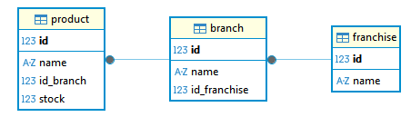

# APP FRANQUICIAS

Aplicación para la gestión de franquicias, sucursales y productos.

## Tecnologías

- Java 17
- Gradle 8.5
- Spring Boot \ WebFlux 3.5.4
- Spring Data R2DBC - R2DBC PostgreSQL

## Ejecucion Docker compose

### Pasos a seguir
1. Clonar este repositorio en la maquina local.
2. Abrir la linea de comandos dentro de la carpeta raiz (donde este el docker-compose).
3. Ejecutar el siguiente comando:
```
docker compose up -d
```
4. En caso de terminar o bajar los servicios levantados:
```
docker compose down
```
5. Finalmente la aplicación esta disponible para usar por:
```
http://localhost:8080/
```

## Operaciones

| Tipo método | Path | Descripción                          | Body (ejemplo)                                              | Observación                                                        |
|-------------|------|--------------------------------------|-------------------------------------------------------------|--------------------------------------------------------------------|
| POST | `/api/v1/franquicias` | Crear franquicia                     | `{ "name": "" }`                                            | Todos los campos requeridos. `name` único.                         |
| POST | `/api/v1/franquicias/sucursales` | Adicionar sucursal a franquicia      | `{ "idFranchise": "", "nameBranch": "" }`                   | Todos los campos requeridos. `nameBranch` único por franquicia.    |
| PUT | `/api/v1/franquicias` | Actualizar franquicia                | `{ "idFranchise": "", "newNameFranchise": "" }`             | Todos los campos requeridos. `newNameFranchise` único.             |
| GET | `/api/v1/franquicias/query` | Consultar información de franquicias | `{ "idFranchise": "", "type" : "" }`                        | Todos los campos requeridos. Permitidos en `type`: `MAX_STOCK`     |
| POST | `/api/v1/sucursales/productos` | Agregar producto a sucursal          | `{ "idBranch": "", "nameProduct": "", "stockProduct": "" }` | Todos los campos requeridos. `nameProduct` único por sucursal.     |
| DELETE | `/api/v1/sucursales/productos` | Eliminar producto de sucursal        | `{ "idBranch": "", "idProduct": "" }`                       | Todos los campos requeridos.                                       |
| PUT | `/api/v1/sucursales/productos` | Actualizar stock                     | `{ "idBranch": "", "idProduct": "", "newStock": "" }`       | Todos los campos requeridos.                                       |
| PUT | `/api/v1/sucursales` | Actualizar sucursal                  | `{ "idBranch": "", "newNameBranch": "" }`                   | Todos los campos requeridos. `newNameBranch` único por franquicia. |
| PUT | `/api/v1/productos` | Actualizar producto                  | `{ "idProduct": "", "newNameProduct": "" }`                 | Todos los campos requeridos. `newNameProduct` único por sucursal.  |

# Colecciones Postman

Ruta: [Franquicias.postman_collection.json](deployment/postman/Franquicias.postman_collection.json)

# Esquema Base de Datos

Ruta: [init.sql](deployment/db/init.sql)




# Proyecto Base Implementando Clean Architecture

## Antes de Iniciar

Empezaremos por explicar los diferentes componentes del proyectos y partiremos de los componentes externos, continuando con los componentes core de negocio (dominio) y por �ltimo el inicio y configuraci�n de la aplicaci�n.

Lee el art�culo [Clean Architecture � Aislando los detalles](https://medium.com/bancolombia-tech/clean-architecture-aislando-los-detalles-4f9530f35d7a)

# Arquitectura


## Domain

Es el m�dulo m�s interno de la arquitectura, pertenece a la capa del dominio y encapsula la l�gica y reglas del negocio mediante modelos y entidades del dominio.

## Usecases

Este m�dulo gradle perteneciente a la capa del dominio, implementa los casos de uso del sistema, define l�gica de aplicaci�n y reacciona a las invocaciones desde el m�dulo de entry points, orquestando los flujos hacia el m�dulo de entities.

## Infrastructure

### Helpers

En el apartado de helpers tendremos utilidades generales para los Driven Adapters y Entry Points.

Estas utilidades no est�n arraigadas a objetos concretos, se realiza el uso de generics para modelar comportamientos
gen�ricos de los diferentes objetos de persistencia que puedan existir, este tipo de implementaciones se realizan
basadas en el patr�n de dise�o [Unit of Work y Repository](https://medium.com/@krzychukosobudzki/repository-design-pattern-bc490b256006)

Estas clases no puede existir solas y debe heredarse su compartimiento en los **Driven Adapters**

### Driven Adapters

Los driven adapter representan implementaciones externas a nuestro sistema, como lo son conexiones a servicios rest,
soap, bases de datos, lectura de archivos planos, y en concreto cualquier origen y fuente de datos con la que debamos
interactuar.

### Entry Points

Los entry points representan los puntos de entrada de la aplicaci�n o el inicio de los flujos de negocio.

## Application

Este m�dulo es el m�s externo de la arquitectura, es el encargado de ensamblar los distintos m�dulos, resolver las dependencias y crear los beans de los casos de use (UseCases) de forma autom�tica, inyectando en �stos instancias concretas de las dependencias declaradas. Adem�s inicia la aplicaci�n (es el �nico m�dulo del proyecto donde encontraremos la funci�n �public static void main(String[] args)�.

**Los beans de los casos de uso se disponibilizan automaticamente gracias a un '@ComponentScan' ubicado en esta capa.**
